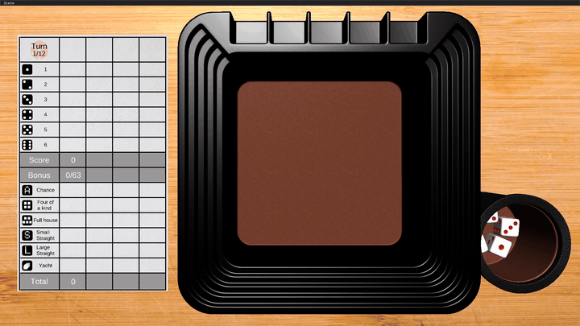
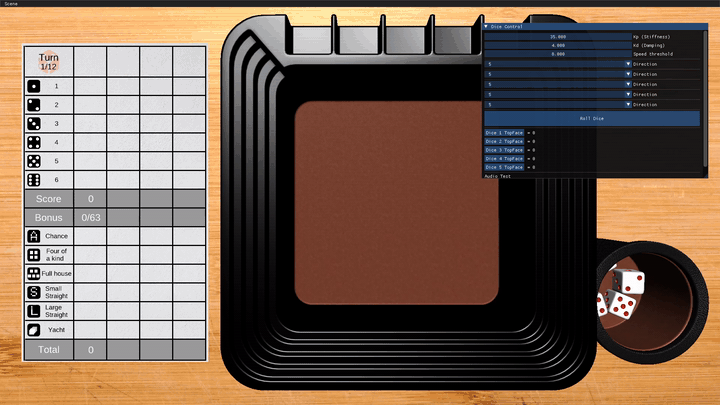
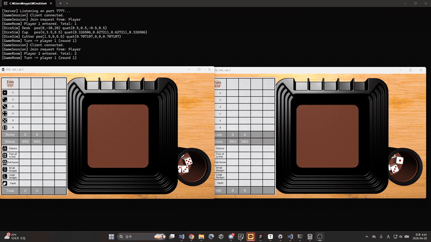

# My-YachtDice 

DirectX11 기반 야추다이스 게임. **커스텀 물리 엔진**을 구현하고, 주사위 결과를 결정하는 물리 연산을 서버에서 수행하도록 구성한 개인 프로젝트입니다.



| | |
|---|---|
| 🎬 멀티플레이 플레이 | https://youtu.be/Szg7PwBPmzQ |
| 🎬 345점 플레이 | https://youtu.be/Bx78MtuWQsE |

---

## 1. 개요

### 주요 개발 항목

1. **물리 엔진 파이프라인 설계** — 힘·회전 운동 적용부터 충돌 감지, Contact 해결, 위치/회전 갱신까지의 처리 구조
2. **접촉 해결의 반복 수행과 반발 유지** — 한 프레임에 접촉 해결을 8회 반복하고, 반복 이전 상대 속도를 bias로 저장해 반발 유지
3. **Orientation Injection** — 회전값을 직접 덮어쓰지 않고 PD 제어 기반 Torque로 목표 자세 유도
4. **클라이언트 동기화** — 주사위 결과를 결정하는 물리 연산은 서버에서만 수행하고, 클라이언트는 스냅샷을 보간해 표시

---

## 2. 디렉토리 구조

### 핵심 구현

```
PhysicsLib/       직접 구현한 물리 엔진
├─ PhysicsWorld   물리 프레임 전체 파이프라인
├─ ContactSolver  반발/마찰/관통 해결
├─ RigidBody      강체 상태 + Orientation Injection
├─ BroadPhase     AABB 기반 후보 추림
├─ NarrowPhase    정밀 충돌 판정 + Contact 생성
└─ IslandBuilder  접촉 그래프를 Island 로 분할

Client/           게임플레이 + 연출 + 패킷 수신
├─ GameScene      게임 상태 머신, 패킷 송신
├─ Dice           주사위 상태 머신 + 스냅샷 보간
├─ DiceCup        컵 흔들기/뒤집기 연출
└─ ClientSession  서버 패킷 수신 핸들러

Server/           주사위 물리 시뮬레이션 + 방/턴 관리
├─ DiceSimulation 고정 물리 환경 + 주사위 시뮬레이션
├─ GameRoom       방/턴 관리, 스냅샷 브로드캐스트
└─ GameSession    클라이언트 패킷 수신 핸들러
```

### 그 외

```
CoreLib/          메모리 풀·Job 큐·스레드 매니저
ServerCoreLib/    IOCP 소켓 서버 코어 (Session / Listener / Service)
RenderLib/        DX11 디퍼드 렌더링 (GBuffer → Lighting → Transparent/Effect → UI)
GameEngineLib/    씬·컴포넌트 시스템, PhysicsManager
Proto/            YachtDice.proto / PacketId.h
ThirdParty/       protobuf
```

> `PhysicsLib`는 다른 어떤 모듈에도 의존하지 않는 독립 라이브러리입니다. 그래서 클라이언트와 서버가 완전히 동일한 물리 코드를 공유합니다.

---

## 3. 물리 프레임 처리 흐름

`PhysicsWorld::Step()` 한 번이 물리 프레임 한 사이클입니다.

📍 [`PhysicsLib/PhysicsWorld.cpp:9`](PhysicsLib/PhysicsWorld.cpp#L9)

| 단계 | 내용 | 코드 |
|---|---|---|
| step 1 | 중력 적용 + **Orientation Injection** + 속도 적분 | `ApplyForce` → `ApplyOrientationInjection` → `IntegrateVelocity` |
| step 2 | 충돌 감지 (BroadPhase → NarrowPhase) | `GetPairsBruteForce` → `TestPair` |
| step 2.5 | 충돌 기반 Wake | sleeping 바디 깨우기 |
| step 3 | Island 분할 후 **Contact 해결** | `IslandBuilder::Build` → `ContactSolver::Resolve` |
| step 4 | 위치/회전 갱신 | `IntegratePosition` |
| step 5–6 | 누적값 클리어 + Sleep 상태 갱신 | `ClearAccumulators` / `UpdateSleepState` |

---

## 4. 주요 구현

### 4.1 Contact Solver — 반복 접촉 해결과 반발 유지

| 항목 | 코드 | 내용 |
|---|---|---|
| 반복 계산 8회 | [`ContactSolver.cpp:26`](PhysicsLib/ContactSolver.cpp#L26) · [`ContactSolver.h:52`](PhysicsLib/ContactSolver.h#L52) | `iterations = 8` |
| restitution bias 저장 | [`ContactSolver.cpp:72`](PhysicsLib/ContactSolver.cpp#L72) `Presolve()` | 반복 **이전** 상대 속도를 저장 |
| bias 적용 지점 | [`ContactSolver.cpp:134`](PhysicsLib/ContactSolver.cpp#L134) `SolveVelocity()` | 매 반복마다 반발 계산에 더함 |

#### 반복 계산 (Iterative Solve)

한 번의 impulse로 파고드는 속도가 제거되지 않아, 같은 계산을 8회 반복합니다.

```cpp
// PhysicsLib/ContactSolver.cpp
void ContactSolver::Resolve(std::vector<Contact>& contacts, float dt)
{
    Presolve(contacts, dt);          // ← restitution bias 는 여기서 1회만 계산

    for (int iter = 0; iter < iterations; ++iter)   // iterations = 8
    {
        SolveVelocity();
        SolvePositionBias();
    }
}
```

#### 반복 이전 속도를 bias로 두어 반발 유지

반복하면 상대 속도가 0으로 수렴해 반발이 사라집니다. 그래서 **반복 시작 전**의 상대 속도를 따로 저장해 두고(`Presolve`), 매 반복의 반발 계산에 더합니다(`SolveVelocity`).

```cpp
// Presolve() — 반복 이전 상대 속도를 1회만 계산해 고정
float closingVel = Vec3Dot(vRelative, ct.normal);
cc.restitutionBias = (closingVel < restitution_threshold)
                   ? cc.mixedRestitution * closingVel : 0.f;

// SolveVelocity() — 매 반복마다 bias 를 더해 반발을 유지
float lambdaN = -(vN + cc.restitutionBias) * cc.effectiveMassNormal;
```

`restitutionBias`는 `Presolve`에서 한 번만 정해지고 반복 루프 안에서 갱신되지 않습니다. 그래서 여러 물체가 동시에 충돌해 반복 중 속도가 크게 변하는 상황에서는, 실제 충돌 세기와 차이가 생길 수 있습니다.

---

### 4.2 Orientation Injection — 물리 운동을 유지하며 목표 자세로 유도



*굴러가던 흐름을 끊지 않고, 목표한 눈이 위를 향하도록 Torque로 유도합니다.*

| 항목 | 코드 | 내용 |
|---|---|---|
| PD 제어식 | [`RigidBody.cpp:247`](PhysicsLib/RigidBody.cpp#L247) `ApplyOrientationInjection()` | `τ = Kp·θ_err·n̂_err − Kd·ω` |
| 파이프라인 삽입 지점 | [`PhysicsWorld.cpp:24`](PhysicsLib/PhysicsWorld.cpp#L24) | step 1(힘 적용) 안에서 호출 |
| Kp / Kd 튜닝값 | [`DiceSimulation.h`](Server/DiceSimulation.h) | `INJECT_KP = 25`, `INJECT_KD = 5.5` |
| 발동 조건 | [`DiceSimulation.cpp:185`](Server/DiceSimulation.cpp#L185) `UpdateInjections()` | `INJECT_SPEED_THRESH` 미만일 때 latch |

#### PD 제어 기반 Torque

```cpp
// PhysicsLib/RigidBody.cpp
void RigidBody::ApplyOrientationInjection()
{
    if (!hasOrientationTarget)
        return;

    // 목표 회전과 현재 회전의 오차
    Quat q_error = orientationTarget * QuatConjugate(orientation);

    if (0.f > q_error.w)
        q_error = Quat(-q_error.x, -q_error.y, -q_error.z, -q_error.w);

    Vec3  outAxis;      // 오차에 의한 회전축  n̂_err
    float outAngle;     // 오차 각도          θ_err
    QuatToAxisAngle(q_error, outAxis, outAngle);

    Vec3 torque = outAxis * (outAngle * orientationInjectionKp)   // P항
                - angularVelocity * orientationInjectionKd;       // D항

    torqueAccum += torque;   // 회전값을 Set 하지 않고 토크로만 합류
}
```

`orientation`을 직접 대입하는 코드가 **없다**는 점이 이 함수의 핵심입니다. 결과는 `torqueAccum`에만 반영되고, 이후 `IntegrateVelocity` → `ContactSolver` → `IntegratePosition`을 정상적으로 통과합니다.

D항(`- angularVelocity * Kd`)은 현재 각속도를 감쇠시킵니다. P항만 사용하면 목표 자세에 수렴하더라도 남은 각속도 때문에 목표를 지나쳐 진동하게 됩니다.

#### 발동 조건 — 속도가 충분히 줄었을 때 한 번만 arm

```cpp
// Server/DiceSimulation.cpp — UpdateInjections()
if (!m_injection[i].active)   continue;
if (m_injection[i].injecting) continue;  // 이미 진행 중이면 재설정하지 않음

float speed = Vec3Length(m_diceBodies[i].GetLinearVelocity());
if (speed < INJECT_SPEED_THRESH)         // 10.f
{
    m_injection[i].injecting = true;
    const Vec3& dir = DIRECTIONS[m_injection[i].targetFace - 1];
    m_diceBodies[i].SetOrientationTarget(QuatFromEuler(dir.x, dir.y, dir.z),
                                         INJECT_KP, INJECT_KD);
}
```

`INJECT_KP = 25`, `INJECT_KD = 5.5`는 직접 튜닝한 상수입니다. 토크를 각가속도로 전환할 때 관성 텐서가 관여하므로, 질량(`BODY_MASS = 5.f`)이 바뀌면 함께 조정해야 하는 값입니다.

---

### 4.3 클라이언트 동기화 — 서버 스냅샷 보간



*두 클라이언트가 같은 서버 스냅샷을 보간해 동일한 주사위 상태를 표시합니다.*

| 항목 | 코드 | 내용 |
|---|---|---|
| 스냅샷 30Hz | [`DiceSimulation.h`](Server/DiceSimulation.h) `SNAPSHOT_INTERVAL = 2` · [`GameRoom.cpp:122`](Server/GameRoom.cpp#L122) | 1/60 × 2 = 1/30초 |
| 스냅샷 페이로드 | [`YachtDice.proto`](Proto/YachtDice.proto) `DiceTransform` | 위치(Vec3) + 회전(Quat) |
| 클라이언트 보간 | [`Dice.cpp:93`](Client/Dice.cpp#L93) · [`Dice.cpp:301`](Client/Dice.cpp#L301) | prev / target / lerpT |

#### 서버 — 2 스텝마다 스냅샷 전송

```cpp
// Server/DiceSimulation.cpp — Step()
while (m_accumulator >= FIXED_DT)          // FIXED_DT = 1/60
{
    UpdateInjections();
    m_world.Step(FIXED_DT);
    ProcessTriggers();

    m_accumulator -= FIXED_DT;
    ++m_stepCounter;

    if (m_stepCounter % SNAPSHOT_INTERVAL == 0)   // SNAPSHOT_INTERVAL = 2
        shouldBroadcast = true;                   // → 1/30초마다 브로드캐스트
}
```

스냅샷에는 위치와 회전만 담습니다. 속도/각속도는 보내지 않습니다.

```protobuf
// Proto/YachtDice.proto
message DiceTransform {
    float px = 1;  float py = 2;  float pz = 3;
    float qx = 4;  float qy = 5;  float qz = 6;  float qw = 7;
}
message S_DICE_SNAPSHOT {
    repeated DiceTransform dice_transforms = 1;
}
```

#### 클라이언트 — prev ↔ target 보간

서버가 물리를 담당하는 구간에 들어간 주사위는 `NETWORK_DRIVEN` 상태가 되고, 이 구간에서 클라이언트의 물리 연산은 주사위에 영향을 주지 않습니다.

```cpp
// Client/Dice.cpp — Update()
case State::NETWORK_DRIVEN:
{
    m_netLerpT += dt / NET_SNAPSHOT_INTERVAL;   // 1/30
    if (m_netLerpT > 1.f) m_netLerpT = 1.f;

    Vec3 pos = Vec3Lerp (m_netPrevPos, m_netTargetPos, m_netLerpT);   // 위치: Lerp
    Quat rot = QuatSlerp(m_netPrevRot, m_netTargetRot, m_netLerpT);   // 회전: Slerp

    m_transform->SetPosition(GameEngine::ToEngine(pos));
    m_transform->SetRotation(GameEngine::PhysicsQuatToEuler(rot));
    break;
}
```

```cpp
// Client/Dice.cpp — SetNetworkTransform() : 스냅샷 수신 시
m_netPrevPos   = Vec3Lerp (m_netPrevPos, m_netTargetPos, m_netLerpT);  // 현재 위치를 prev 로
m_netPrevRot   = QuatSlerp(m_netPrevRot, m_netTargetRot, m_netLerpT);
m_netTargetPos = pos;      // 새 스냅샷을 target 으로
m_netTargetRot = rot;
m_netLerpT     = 0.f;      // 경과시간 초기화
```

클라이언트는 스냅샷 사이를 보간하므로 다음 스냅샷이 도착할 때까지 참조할 목표 상태가 없습니다. 패킷이 지연되면 `m_netLerpT`가 1에 도달한 뒤 주사위가 마지막 수신 상태에 머무릅니다.

